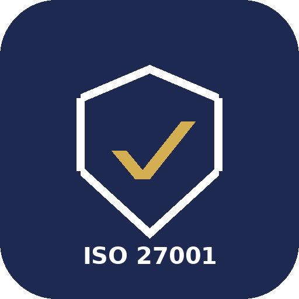

# GLPI GRC Manager

<p align="center"></p>

> Plateforme de gouvernance, risque et conformité (GRC) et ISO 27001 générique, nativement
> intégrée à GLPI.

[](LICENSE)
[](ROADMAP.md)
[](docs/design/DEVELOPMENT_PLAN.md)

🇫🇷 **Français** | [🇬🇧 English](README.en.md)

## Le problème

GLPI sait exactement quels matériels, logiciels et systèmes composent votre organisation. Ce
qu'il ne sait pas faire nativement, c'est répondre aux questions d'un responsable sécurité ou
d'un auditeur ISO 27001 :

> **Quels sont les risques organisationnels (pas seulement techniques) de mon organisation, qui
> les a acceptés et pourquoi, et suis-je conforme à l'Annexe A ?**

**GLPI GRC Manager** couvre le risque organisationnel générique (clause 6.1.2/8.2 ISO 27001) :
humain, processus, physique, tiers/fournisseur, avec acceptation, traitement, Déclaration
d'Applicabilité (SoA), audits internes et actions correctives — et, depuis la v2.0, un véritable
objet ITIL "Incident de sécurité" (absorbé du plugin jumeau glpi-security-incidents, désormais
archivé), avec ses champs de classification ISO 27001 fusionnés dessus.

## Ce que le plugin apporte (voir ROADMAP.md)

- **Registre de risques génériques** : catégorie (humain/processus/physique/tiers/technique),
  probabilité, impact, niveau de risque calculé, décision de traitement (accepter/mitiger/
  transférer/éviter), propriétaire, justification, date de revue.
- **Déclaration d'Applicabilité (SoA)** : les 93 contrôles de l'Annexe A ISO 27001:2022 (clause
  6.1.3).
- **Programme d'audit interne** : non-conformités, actions correctives et préventives (CAPA).
- **Registre de risques fournisseurs/tiers.**
- **Suivi des formations de sensibilisation à la sécurité.**
- **Revues de direction.**
- **Incidents de sécurité** : objet ITIL complet dans le menu Assistance (acteurs, workflow,
  tâches, notifications, suivi CVE), avec classification ISO 27001 (catégorie, sévérité, cause
  racine/enseignements tirés obligatoires à la clôture) fusionnée dessus (Annexe A A.5.24-27).
  Chaque partie du module est activable/désactivable indépendamment (Configuration > Plugins).

## État du projet

**Version stable v2.2.0**, publiée et installable dès maintenant : registre de risques génériques
(matrice probabilité x impact administrable, cartographie interactive, filtres, rappels de revue),
Déclaration d'Applicabilité (93 contrôles Annexe A ISO/IEC 27001:2022), programme d'audit interne
avec non-conformités et CAPA, registre de risques fournisseurs/tiers, suivi des formations de
sensibilisation (dont le taux de réussite des évaluations) et revues de direction, module Incidents
de sécurité complet (objet ITIL, suivi CVE, absorbé depuis le plugin jumeau
`glpi-security-incidents` en v2.0.0), et un tableau de bord ISMS complet. Voir
[ROADMAP.md](ROADMAP.md) pour ce qui est prévu ensuite et
[CHANGELOG.md](CHANGELOG.md) pour l'historique complet des versions publiées.

## Installation

**1. Récupérer le code** dans `plugins/` de votre GLPI, sous le nom **`grcmanager`** (GLPI en
déduit la clé du plugin) :

- Depuis une [release](https://github.com/parime/glpi-iso27001-management/releases) (recommandé,
  aucune dépendance à installer — `vendor/` est déjà inclus dans le ZIP) : téléchargez
  `glpi-iso27001-management-X.Y.Z.zip`, extrayez-la dans `plugins/`, puis renommez le dossier extrait
  en `grcmanager`.
- Ou en développement, depuis le code source :

```bash
cd /var/www/glpi/plugins
git clone https://github.com/parime/glpi-iso27001-management.git grcmanager
cd grcmanager
composer install --no-dev
```

**2. Installer et activer**, depuis l'interface (**Configuration > Plugins**, « GLPI GRC Manager »)
ou en ligne de commande :

```bash
php bin/console plugin:install grcmanager
php bin/console plugin:activate grcmanager
```

## Documentation

📖 **[Voir le tutoriel complet](docs/TUTORIAL.md)** : le flux entier du plugin, de l'activation au
tableau de bord, en passant par le registre de risques, la matrice probabilité x impact, la SoA et
les audits/CAPA, avec une capture d'écran réelle par étape (disponible en français et en anglais).

| Document | Contenu |
|---|---|
| [docs/design/DEVELOPMENT_PLAN.md](docs/design/DEVELOPMENT_PLAN.md) | Plan de développement par sprints |
| [ROADMAP.md](ROADMAP.md) | Roadmap publique par version |
| [CHANGELOG.md](CHANGELOG.md) | Historique des évolutions |

## Compatibilité cible

- GLPI 11.x et GLPI 12.x (un seul paquet pour les deux versions)
- PHP selon la matrice de compatibilité de la version de GLPI utilisée (PHP 8.2 minimum)

## Avertissement : ISO 27001 et référentiels tiers

**Ce projet n'est ni affilié à l'ISO (Organisation internationale de normalisation), ni à l'IEC,
ni à l'AFNOR, ni approuvé ou certifié par ces organismes.** La mention « ISO 27001 » dans le nom
du dépôt et dans la documentation indique uniquement le référentiel que le plugin aide à suivre.

- **Ce que le plugin contient** : uniquement les **références** des 93 contrôles de l'Annexe A
  d'ISO/IEC 27001:2022 (A.5.1 à A.8.34), leur thème et un **titre court** par contrôle.
- **Ce qu'il ne contient pas** : le texte des contrôles, les recommandations de mise en œuvre
  d'ISO/IEC 27002, ni le texte des exigences (clauses 4 à 10). Les champs de justification et de
  mise en œuvre sont à rédiger par votre organisation.
- **La norme doit être acquise** auprès de l'[ISO](https://www.iso.org/standard/27001) ou de
  l'[AFNOR](https://www.boutique.afnor.org/) : le texte officiel d'ISO/IEC 27001 (exigences) et,
  idéalement, d'ISO/IEC 27002 (guide de mise en œuvre) est indispensable pour mettre en œuvre un
  SMSI et viser la certification.
- **Le plugin ne délivre aucune certification** : celle-ci est délivrée par un organisme de
  certification accrédité. Le plugin aide à préparer l'audit, rien de plus.

**Référentiels complémentaires consultables dans le plugin :**

- **CIS Critical Security Controls® v8** : les intitulés des 18 contrôles et 153 mesures
  (*Safeguards*) sont reproduits sans modification, en anglais, d'après la publication du
  [Center for Internet Security, Inc.](https://www.cisecurity.org/controls), sous licence
  [Creative Commons Attribution-NonCommercial-NoDerivatives 4.0 International (CC BY-NC-ND 4.0)](https://creativecommons.org/licenses/by-nc-nd/4.0/).
  © Center for Internet Security, Inc. CIS Controls® et CIS Critical Security Controls® sont des
  marques du Center for Internet Security, Inc. Ce projet n'est ni affilié ni approuvé par le CIS.
  Cet extrait n'est pas couvert par la licence GPLv3 du plugin et ne peut pas être réutilisé à
  des fins commerciales.
- **NIST Cybersecurity Framework (CSF) 2.0** : publication du
  [National Institute of Standards and Technology](https://www.nist.gov/cyberframework)
  (gouvernement fédéral des États-Unis), dans le domaine public.
- **Directive (UE) 2022/2555 « NIS2 »** : articles 20, 21 §2 et 23 §4. Les dix mesures de
  l'article 21 §2 sont reproduites d'après les versions officielles française et anglaise
  publiées sur [EUR-Lex](https://eur-lex.europa.eu/eli/dir/2022/2555/oj), les articles 20 et 23
  sont résumés. © Union européenne, https://eur-lex.europa.eu/ — réutilisation autorisée
  (décision 2011/833/UE de la Commission). Seule la version publiée au Journal officiel de l'UE
  fait foi. La correspondance avec l'Annexe A ISO 27001 est indicative et établie par ce projet.

## Licence

Distribué sous licence [GNU GPLv3](LICENSE). Projet gratuit, communautaire, sans fonctionnalité
payante obligatoire. Les extraits de référentiels tiers (CIS Controls, NIST CSF, NIS2) restent sous
leur licence d'origine : voir l'avertissement ci-dessus.

## Contribuer

Les contributions sont bienvenues. Voir [CONTRIBUTING.md](CONTRIBUTING.md),
[CODE_OF_CONDUCT.md](CODE_OF_CONDUCT.md) et [GOVERNANCE.md](GOVERNANCE.md).

## Sécurité

Pour signaler une vulnérabilité, **ne pas ouvrir d'issue publique** : voir la procédure décrite
dans [SECURITY.md](SECURITY.md).

## Support

Voir [SUPPORT.md](SUPPORT.md) pour les canaux d'aide et de discussion.
